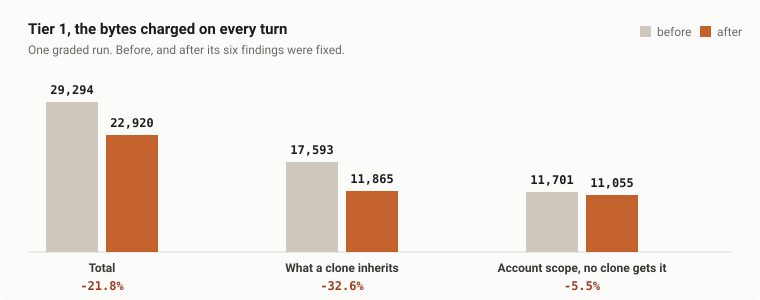
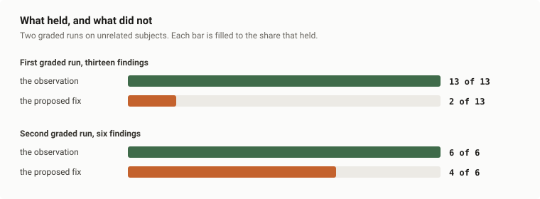

# ecoctx

A Claude Code plugin that finds where your agent's tokens go and tells you which cuts are worth
making.

It measures what loads on every turn, ranks what you can actually change, and months later grades
each prediction against what it really bought.

```
/plugin marketplace add uchimata2/ecoctx
/plugin install ecoctx@ecoctx
```

Say **"audit my context"** to start. Say **"grade the audit"** later, once the fixes exist.

## What it measured

An example run, graded end to end, on a subject the method did not come from. Everything charged on
every turn, before and after:



**6,374 bytes off every turn, 21.8%.** Of that, 5,728 came out of files a clone inherits, **-32.6%**,
and 646 out of account-level files no clone gets, **-5.5%**. Quote the total as a property
of the repository and you over-attribute by nearly half.

**The audit's own additions to tier 1 were 580 bytes, 9.1% of what it removed.** In the method's first
graded run that figure was 88% - a closing pass writing governance into the file it had just cleaned.
Here every rule went into the script or the file it governs, never into the always-loaded one.

Some of what it recommends still makes the repository bigger. That run added a 6,250-byte document, a
205,646-byte asset and 58 lines of checks - none on a load path. If you check the total and expect it
to fall, you will think the method failed.

This project applied the method to itself once, on the one figure it pays every session: the routing
description went from 610 to 497 bytes, an 18.5% cut with every trigger kept, re-measured by
`tools/check_readme.py` on every gate run.

### Whether to trust it

Two runs are graded, on unrelated subjects:



Thirteen of thirteen observations held in the first, six of six in the second. Bands did worse: two of
thirteen, then four of six. **Every error sat in the proposed fix, none in the observation**, on both
runs.

So the method marks a proposed change as a hypothesis when you write it, and tells you to re-measure
before carrying it out. A ranking obeyed instead would have deleted two tools' payloads.

## What it does

Sixteen steps, two phases. A run loads one reference at a time.

| Phase | Steps | Work |
| :--- | :--- | :--- |
| measure | 1-5 | inventory the surfaces, research externally with a search record |
| judge | 6-11 | screen, band, rank, split, raise the work as tasks |
| standing | 12-16 | grade every band, price the remedies, write policy |

Phase 2 needs measured outcomes, so a single session runs phase 1 and stops.

| Surface | What it inventories |
| :--- | :--- |
| A load path | everything entering context unasked, with size, controller and recurrence |
| B read path | what one unit of work opens, in what format, how much was needed |
| C tool output | what each gate or command prints |
| D write volume | what the same unit produces |
| E workflow | cuts across all four: it changes *when* a cost is paid, not how large it is |

Five outputs, split by who can act: portable findings, your ranked report, an upstream section to hand
over, a byproduct register, and a friction log addressed to the method itself.

It refuses four things: a catalogue with no search record, a gain band written before the mechanism is
named, a policy rule that does not name the document already governing the act, and resolving a
collision with your own policy - your rule stands and the collision is reported.

## Limits

- **It does not save tokens on its own.** Some of what it recommends makes the repository larger.
- **It measures artifacts, not sessions.** A file size is what a session *could* pay.
- **It ranks on context runway alone.** An act that reprices a session without changing what sits in
  the window is named and never banded.
- **It cannot separate operative prose from narrative** mechanically.
- **It does not price attention.** Shorter is assumed better; where a cut would make the agent guess,
  that is a risk field, not a measurement.
- **No stranger has operated it.** The subject has been a stranger three times; the operator never has.
- **Phase 2 has run twice.** Enough to repeat a result, not enough to call it a rate.

The stranger limit cannot be closed by any work in this repository, so it ships disclosed rather than
solved. Why it is not a release blocker is on [#47](../../issues/47).

## What it costs to install

Bytes off the filesystem, on LF, re-measured by `tools/check_readme.py` on every gate run.

| Stage | Bytes | Paid |
| :--- | ---: | :--- |
| Routing description | 497 | every session, used or not |
| `skills/ecoctx/SKILL.md` body | 8,837 | when the skill activates |
| `skills/ecoctx/references/measure.md` | 28,283 | steps 1 to 5 only |
| `skills/ecoctx/references/judge.md` | 32,814 | steps 6 to 11 only |
| `skills/ecoctx/references/standing.md` | 18,276 | steps 12 to 16 only |

497 bytes is the only figure that compounds. The body routes to exactly one reference, so the largest
single-phase cost is 8,837 plus 32,814, or 41,651 bytes.

## What ships, and what you need

Six files are the method: `skills/ecoctx/SKILL.md`, the three references, and `tools/findings.py` with
`tools/selftest.py`. Two more are packaging, in `.claude-plugin/`. The six checkers in `tools/` check
this repository and are not part of an install - one fails when a chart in `assets/` draws a figure this
README does not state, another when the prose here picks up a habit it does not have.

- **Python 3**, standard library only, no network. `python tools/selftest.py` passes 19 of 19 on
  **3.12.10** and **3.14.4**. The floor below them is **undetermined** - unmeasured, not absent. On any
  other version, that command is how you find out, which is why it ships.
- **Text task records**, if you want `findings.py`: a `key: value` front-matter block, one key naming a
  finding. If your tracker is not files, that one tool does not apply and no step depends on it.
- **A way to measure without reading** - sizes off the filesystem, command output captured to a file.
  Any language; the script is throwaway.
- **An agent that can report its own context.** Step 1 asks the agent what it loaded, never reads the
  screen. A harness that cannot answer leaves step 1 nothing to observe, and the audit says so.

Version `rubric 2, revision 2`, stated in `skills/ecoctx/SKILL.md`. The rubric number says whether a
phase 1 and the phase 2 grading it ran under the same rubric. `plugin.json` renders it `2.2.0` because
the platform requires semver.

## Status

Pre-publication, which is a fact about publication and not about the gate: passing it makes a release
possible, and nobody has performed one. Three runs are recorded:

| When | Subject | Steps | Produced |
| :--- | :--- | :--- | :--- |
| 2026-08 | where the method was invented | **1-16** | the graded table above: thirteen findings, eleven bands missed |
| 2026-08-15 | a second repository | 1-11 | two documents, and no answer to what the skill should have said |
| 2026-09-04 | a third, unrelated to either | **1-16** | six findings, all fixed, then graded: 21.8% off every turn |

The gate is three rows, passed when all three issues are closed: the method's known silences
([#40](../../issues/40), [#41](../../issues/41), [#42](../../issues/42), [#43](../../issues/43)), what
ships ([#49](../../issues/49)), and what a version means ([#50](../../issues/50)). State is not repeated
here, because a copy of it would be wrong the day a row closes.

Work is tracked as GitHub issues. `status:` is a label and an issue's open or closed state is written
from it, so closing one in the web interface changes the rendering without changing the fact.

Defects and requests belong in issues. The method itself improves from runs: each produces a graded
table like the one above, which is the evidence a rubric change needs.

MIT. See [LICENSE](LICENSE).
