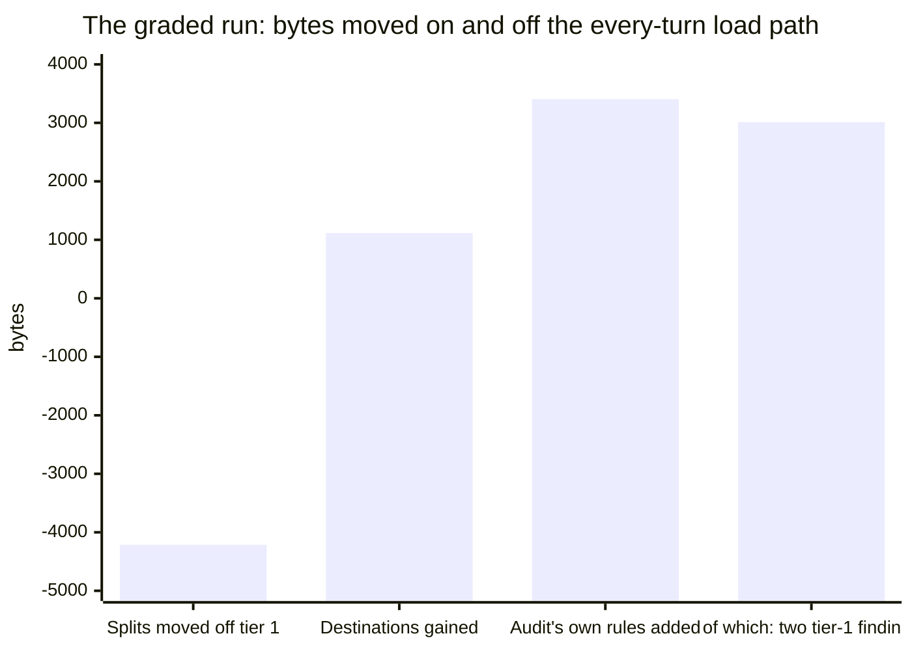
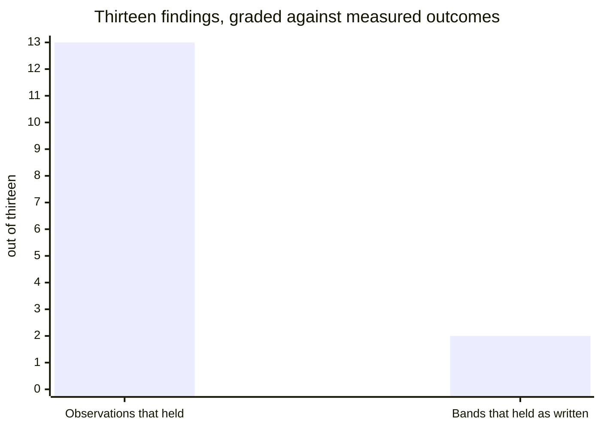

# ecoctx

**Find out what your coding agent is paying for before it does anything, and fix the part worth
fixing.**

Every session, an agent loads a set of files nobody chose deliberately: instruction files at three
scopes, a memory store, the descriptions of every skill it might use, the tool catalogue, whatever a
hook prints. That is charged on every turn of every session, and almost nobody has measured theirs.

`ecoctx` measures it, ranks what you can actually change, and writes a record another person can check.
Then, months later, after the fixes are built, it comes back and grades every prediction against what it
really bought.

It will not necessarily make your repository smaller. What you get is a list of which files are
expensive, and afterwards a record of which of your fixes worked and which did not.

---

## Install

```
/plugin marketplace add uchimata2/ecoctx
/plugin install ecoctx@ecoctx
```

Then say what you want. The skill routes on it:

| Say | You get |
| :--- | :--- |
| **"Audit my context"** | Step 1. Phase 1, steps 1 to 11: inventory, research, screen, rank, raise the work |
| **"Grade the audit"** | Step 12. Phase 2, steps 12 to 16 - only after the raised work is done, which is months later |

A single session runs phase 1 and stops. Phase 2 needs measured outcomes to grade against, and those do
not exist until somebody has built the fixes.

You need Python 3 for the two programs that ship, a tracker whose task records are text files if you
want `findings.py`, and an agent that can report its own context. Details under
[what ships](#what-ships-and-what-you-need).

---

## What it has actually bought

One run has been graded end to end. Its figures are below, with the growth next to the saving, because
**some of what this method recommends makes your repository bigger.**



The two halves were measured separately, and nothing here subtracts one from the other:

- **Splitting documents moved 4,214 bytes off the load path**, and cost 1,117 bytes at the destinations
  plus a new document of roughly 10 KB. The repository got bigger and the per-turn charge got smaller.
- **The audit then put 3,405 bytes back onto tier 1** - and 3,012 of those came from the two findings
  written to govern tier 1. Most of the method's cost was its own output, which is reported here rather
  than quietly subtracted from the saving.

This project applied the method to itself once, on the one figure it pays every session: its routing
description went from **610 to 497 bytes**, an 18.5% trim with every trigger kept. `tools/check_readme.py`
re-measures that on every run of the gate, so it fails a check rather than waiting for a reader.

### Whether to believe the next one

The second phase grades those predictions, and the result is not flattering:



**The inventory was right thirteen times out of thirteen. Two of the thirteen bands held as written.**
Four were wrong on magnitude, three on the shape of the change, one on its premise, and one was measuring
a unit that did not exist and was withdrawn. One finding understated its own effect by twenty times. One
was worth doing by being refused, and the refusal was the deliverable.

Every error sat in the proposed remedy and none in the observation. That is why the method marks a
proposed change as a hypothesis at the moment you write it, and why it tells you to re-measure a remedy
before carrying it out. A ranking obeyed instead of re-measured would have deleted two tools' payloads.

A method that only publishes its steps is asking to be trusted. The grading table is what makes this one
checkable.

---

## What it can do

**Sixteen steps in two phases**, and a run loads exactly one reference at a time.

| Phase | Steps | What happens |
| :--- | :--- | :--- |
| **1 - measure** | 1 to 5 | Inventory four surfaces, then research externally with a search record |
| **1 - judge** | 6 to 11 | Screen, band, rank, split, raise the work as tasks |
| **2 - standing** | 12 to 16 | Grade every band, price the remedies, fix the method, write policy |

**Four surfaces, and a fifth thing that cuts across them.**

| | What it inventories |
| :--- | :--- |
| **A - load path** | everything entering context unasked, with its size, controller and recurrence |
| **B - read path** | what one unit of work opens, in what format, and how much was needed |
| **C - tool output** | what each gate or command prints |
| **D - write volume** | what the same unit produces |

**E, workflow and tooling**, cuts across all four: when a gate must run rather than may, whether a suite
runs whole or targeted, whether read-heavy work is delegated. Its findings change *when* a cost is paid
rather than how large it is.

**Five outputs**, split by who can act rather than by subject: the portable findings, this project's
ranked report, an upstream section written to be handed over, a byproduct register, and a friction log
addressed to the method itself.

**Four things it refuses to do.** Present a catalogue with no search record. Write a gain band before
naming the mechanism. Emit a standing policy without naming the document that already governs the act.
Resolve a collision with your own policy - the method is a guest, so your rule stands and the collision
is reported.

---

## What it is not

**It does not save tokens on its own.** It finds where your bytes go, and some of what it recommends
makes the repository larger. Two of the largest findings in the graded run reduced nothing and were still
right, so a reader who checks the total and expects it to fall will think the method failed.

**It does not write policy for you.** The last step will not emit a rule until it has named a document
that already governs the thing, priced what the rule costs to load, and said whether it extends, narrows
or replaces the nearest existing rule.

**It is not bound to one agent or harness.** No file of any one repository is named in the method, and
nothing assumes a particular set of tools, plugins or configuration formats. That constraint gets tested
by running the skill somewhere else, not by asserting it.

**It is not a substitute for reading.** Every band it writes is a claim you can check, and several in the
graded run did not survive being checked.

**And it cannot see everything.** It measures artifacts, not sessions - a file size is what a session
*could* pay. It ranks on context runway alone, so an act that reprices a session without changing what
sits in the window is named and never banded. It cannot separate operative prose from narrative
mechanically. It does not price attention: a shorter context is assumed better, and where a cut would
make the agent guess, that is a risk field rather than a measurement.

---

## What it costs to have installed

A skill that audits context economy and is expensive to keep around is the joke that writes itself, so
here is the bill. Measured in bytes off the filesystem, on LF, and re-measured by `tools/check_readme.py`
on every run of the gate - so a figure below that has gone stale fails a check rather than waiting for a
reader.

| Stage | Bytes | Paid |
| :--- | ---: | :--- |
| Routing description | 497 | every session, whether or not you use it |
| `skills/ecoctx/SKILL.md` body | 8,632 | when the skill activates |
| `skills/ecoctx/references/measure.md` | 28,283 | steps 1 to 5 only |
| `skills/ecoctx/references/judge.md` | 32,584 | steps 6 to 11 only |
| `skills/ecoctx/references/standing.md` | 16,571 | steps 12 to 16 only |

497 bytes is the only figure that compounds. Everything below it is paid once, by a session that asked
for it, and never two references at a time, because the body routes to exactly one. The largest possible
single-phase cost is 8,632 plus 32,584, or 41,216 bytes, and the common case is smaller.

## What ships, and what you need

Six files are the method. Two more are packaging - `.claude-plugin/plugin.json` and
`.claude-plugin/marketplace.json`, which are what make it installable. The rest of the tree is this
repository checking itself.

| Ships | What it is |
| :--- | :--- |
| `skills/ecoctx/SKILL.md` | the body - the routing table, the four refusals, the two rules that decide most disagreements |
| `skills/ecoctx/references/measure.md`, `judge.md`, `standing.md` | the steps, one file per stretch of the run, and never more than one loaded |
| `tools/findings.py` | answers *which finding is which task, and what state is it in*. Tracker-agnostic by configuration, reading `.ecoctx.json` at the root of the repository being audited |
| `tools/selftest.py` | exercises `findings.py` against fixtures it builds itself. It ships because of the Python floor below |

| Stays here | Why |
| :--- | :--- |
| `tools/check_readme.py` | re-measures the figures *this* README publishes |
| `tools/check_steps.py` | asserts *this* body's step partition against *these* references |
| `tools/check_tracker.py` | flags an issue whose open/closed state disagrees with its `status:` label |
| `tools/check_all.py` | runs this repository's own checkers, from a manifest that names them |

Those are worth reading as worked examples - `check_all.py` is this method's partition-with-no-fourth-
outcome applied to a gate rather than to a report - but there is nothing in them for a consumer to run.

**The version is stated in `skills/ecoctx/SKILL.md`**, with what its two numbers mean. One of them exists
only to say whether a phase 1 and the phase 2 grading it, taken months apart, were run under the same
rubric.

**What you need.**

- **Python 3**, for the two tools that ship. Standard library only, no third-party packages, no network.
  `python tools/selftest.py` passes 19 of 19 on **3.12.10** and on **3.14.4**, which are the two
  interpreters this project has run it on. **The floor below them is undetermined** - unmeasured, not
  absent. If you are on something else, that command is how you find out, and it is why the self-test is
  in the shipping set rather than kept here.
- **Task records `findings.py` can read**: text files opening with a `key: value` front-matter block, one
  key naming a finding. Field names, the glob and the report paths are configurable; the shape is not. If
  your tracker is not files - this project's is not, it is GitHub Issues - that one tool does not apply,
  and no step of the method depends on it.
- **A way to measure without reading.** File sizes come off the filesystem, and command output is
  captured to a file whose length is measured without printing it. Any language will do; the method names
  none, and the script is throwaway.
- **An agent that can report its own context.** Step 1 establishes what loads by asking the agent what it
  has loaded, never by reading the screen. A harness that cannot answer leaves that step with nothing to
  observe, and the audit says so rather than reporting what was visible.

## Status

**Pre-publication** - a fact about publication, not about the gate below. Passing the gate makes a
release possible; it does not perform one, and nobody has. The two limits disclosed under the gate stay
true whatever its rows say, and they are the honest reason to read this section before trusting the
method. Three runs are recorded, and they are not the same thing:

| When | Subject | Steps | What it produced |
| :--- | :--- | :--- | :--- |
| 2026-08 | the repository where the method was invented | **1-16** | The graded table above - thirteen findings, eleven bands missed |
| 2026-08-15 | a second repository | 1-11 | Two documents, and no answer to what the skill should have said |
| 2026-09-04 | a third, unrelated to either | 1-11 | Six findings, and four entries saying what the method failed to say |

**One run has been graded end to end.** The other two are phase 1, which is all a single session can do.
Running against a repository that is neither the first subject's nor this one was an acceptance criterion
here until 2026-09-04; it is met.

### The publication gate

What *ready* means here is written down rather than assembled each time somebody asks. Three rows, and
the gate is passed when all three of these issues are closed:

| Row | Tracked as |
| :--- | :--- |
| The method's four known silences are closed | #40, #41, #42, #43 |
| What ships is stated, and what a consumer must already have | #49 |
| A version number is defined, and says whether the rubric moved | #50 |

**The state is deliberately not repeated here.** *Open* or *met* in this table would be a second copy of
a fact the tracker already holds, and it would be wrong on the day a row closes - which is the failure
this project keeps finding in its own prose. Open the issues; that is what checkable means.

**Two candidates were considered and are not gate rows, because no work in this repository can reach
them.** A row its owner cannot close does not gate a release, it cancels one. Both ship as disclosed
limits instead:

- **No stranger has operated the method.** The subject has been a stranger three times over; the operator
  never has. Gating on it is circular - publication is how a stranger is reached - so it is disclosed
  rather than waited for, and this sentence is the disclosure.
- **Phase 2 has run once, on the repository where the method was invented.** An external one needs an
  external phase 1's raised work implemented first, which is months away by construction.

The gate itself, and the reason behind each verdict, is #47.

**A single session runs phase 1, and only phase 1.** Steps 12-16 grade predictions against measured
outcomes, so they need the raised work to have been implemented first. A run's report still carries all
sixteen rows - the second phase's five marked *not run*, with that reason. Anyone expecting sixteen steps
in one sitting is expecting something the method refuses.

Work on this repository is tracked as GitHub Issues, using taskmd's issues backend. One task per issue,
and the issue number is the task id. Two consequences worth knowing before you open one: `status:` is a
label, and the open or closed state of an issue is written from that label, so closing an issue in the
web interface changes the rendering without changing the fact. Ids come from GitHub, so nothing here
writes a task id before its issue exists.

Improvements arrive two ways, and they are not the same channel. Defects and requests belong in Issues.
The method itself improves from runs, because each one produces a graded table like the one above, and
that is the evidence a change to the rubric needs. An issue saying a step feels thin is worth much less
than a search record showing what the step missed.

## Licence

MIT. See [LICENSE](LICENSE).
